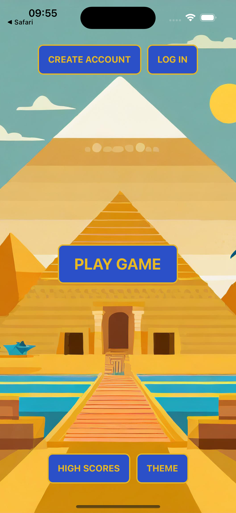
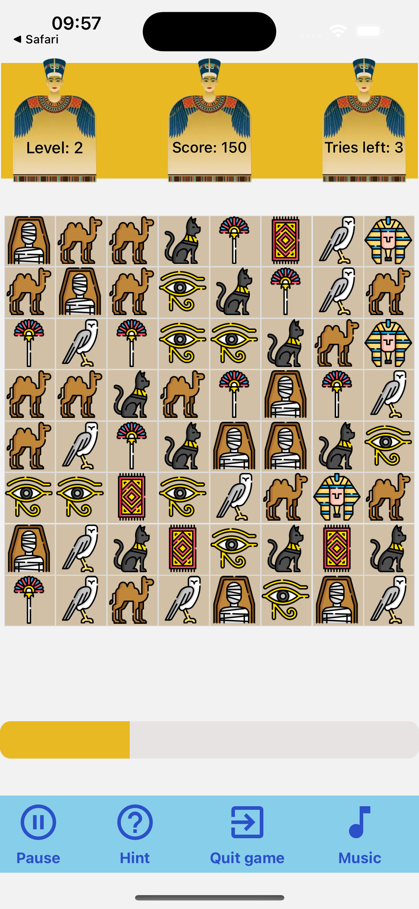

# Jewels Juggle

   

## Description

Jewels Juggle is a personal rendition of the classic game Bejeweled. The game is built using React Native with Expo for the front-end and Node.js with Express.js for the back-end. The back-end is connected to a MariaDB database to store user information and high scores.

## Features

### Gameplay

-   Sound effects
-   High score tracking
-   User rank tracking

### Interface

-   Theme selection

### User account and notifications

-   User authentication
-   Email notification when user loses a rank
-   Score recap sent to user's email one hour after last game ends

## Screenshots

    
    
    <video src="doc/bejeweled_demo.mp4" style="flex: 1;"></video>

